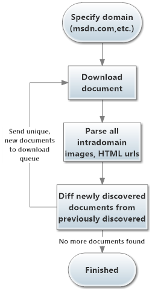
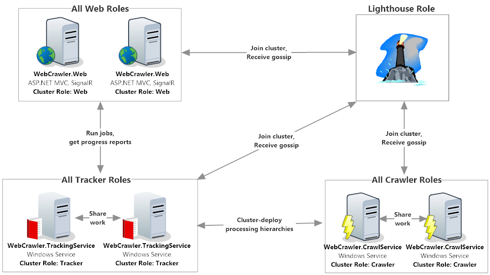
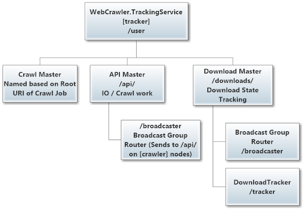
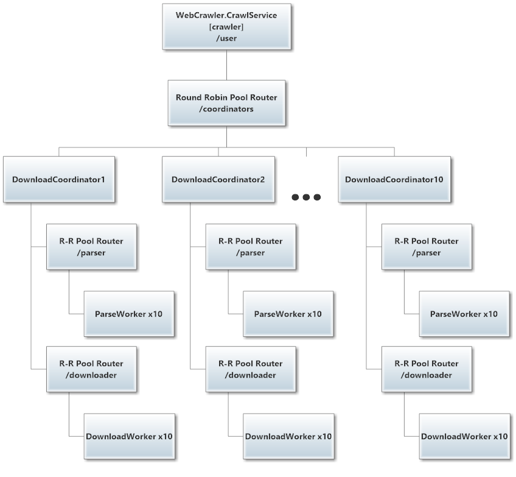
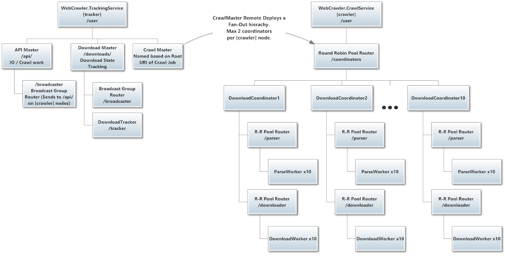
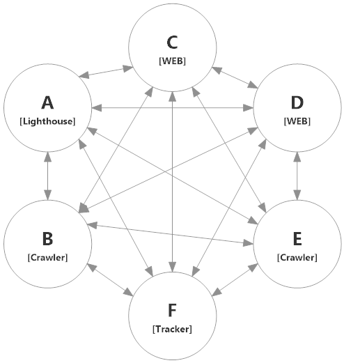
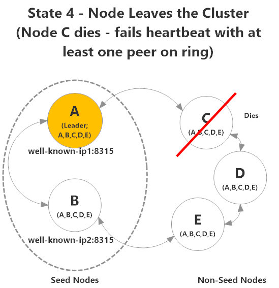
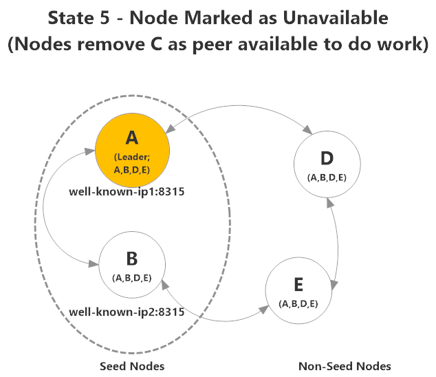

# ASP.NET and Windows Service Microservices with Akka.Cluster

The goal of this sample is to show you how to use `Akka.Cluster` to form resilient systems that can scale out across multiple processes or machines without complicated user-defined code or expensive tools.

In this sample you'll also see how to integrate Akka.NET with the following technologies:

- **[ASP.NET MVC5](http://www.asp.net/mvc/mvc5)**;
- **[SignalR](http://signalr.net/ "Websockets for .NET")** - Websockets library for .NET;
-  **[Topshelf](http://topshelf-project.com/ "Topshelf Project - easily turn console apps into Windows Services")** - Windows Services made easy;
-  **[HTML Agility Pack](http://htmlagilitypack.codeplex.com/)** - for parsing crawled web pages; and
- **[Lighthouse](https://github.com/petabridge/lighthouse "Lighthouse - Service Discovery for Akka.NET")** - a lightweight service discovery platform for Akka.Cluster.

## Sample Overview

In the `WebCrawler` sample we're actually going to run four different pieces of software concurrently:

* **`[Lighthouse]`** - An instance of the **[Lighthouse](https://github.com/petabridge/lighthouse "Lighthouse - Service Discovery for Akka.NET")** service, so you'll want to clone and build that repository in you intend to run this sample;
* **`[Crawler]`** - A dedicated Windows Service built using **[Topshelf](http://topshelf-project.com/ "Topshelf Project - easily turn console apps into Windows Services")**. This is where all of the scalable processing work is done in this sample, and multiple instances of these services can be run in parallel in order to cooperatively execute a web crawl. The source for `[Crawler]` is inside the [`src\WebCrawler.CrawlService`](src/WebCrawler.CrawlService) folder. This is a stateless service, designed to be scaled out dynamically.
* **`[Tracker]`** - A dedicated Windows Service built using **[Topshelf](http://topshelf-project.com/ "Topshelf Project - easily turn console apps into Windows Services")**. This is where all the state of a webcrawl is managed, and the service that ensures that processing isn't wasted by allowing only one `CrawlJob` per domain. This is a stateful service that remotely deploys fan-out processing hierarchies under the `DownloadCoordinator` onto `[Crawler]` nodes in the cluster. The source for `[Tracker]` is inside the [`src\WebCrawler.TrackingService`](src/WebCrawler.Service) folder.
* **`[Web]`** - An ASP.NET MVC5 application that uses **[SignalR](http://signalr.net/ "Websockets for .NET")** to send commands to and receive data from `[Tracker]` instances. Multiple `[Web]` instances may be run in parallel, but they're unaware of eachother's crawl jobs by default.

> NOTE: `WebCrawler.sln` should attempt to launch one instance of `[Crawler]`, `[Tracker]` and `[Web]` by default.

### Goal: Use Microservices Built with Akka.Cluster to Crawl Web Domains with Elastic Scale

The goal of this sample is to have all three of these services work cooperatively together to crawl multiple web domains in parallel. Here's what the data flow of an individual domain crawl looks like:



The crawl begins by downloading the root document of the domain, so if we were to crawl [http://petabridge.com/](http://petabridge.com "Petabridge LLC homepage") we'd begin by downloading `index.html`.

On `index.html` we discover links to more images and documents, so we mark those new pages as "discovered" and repeat the downloading / parsing process until no more content has discovered.

> NOTE: the only thing this sample does not attempt to do is save the documents to a persistent store; that's an exercise left up to readers.

Here's an example of the service in-action, crawling MSDN and Rotten Tomatoes simultaneously across two `[Crawler]` processes:

<a href=
"diagrams/crawler-live-run.gif"><p>Click for a full-sized image.</p></a>

## Critical Concepts

In this example you'll be exposed to the following concepts:

1. **Akka.NET Remoting** - how remote addressing, actor deployment, and message delivery works in Akka.NET.
2. **Microservices** - the software architecture style used to organize the WebCrawler sample into dedicated services for maximum resiliency and parallelism.
3. **Clustering** - a distributed programming technique that uses peer-to-peer networking, gossip protocols, addressing systems, and other tools to allow multiple processes and machines to work cooperatively together in an elastic fashion.
4. **ASP.NET & Windows Services Integration** - how to integrate Akka.NET into the most commonly deployed types of networked applications in the .NET universe.

### Akka.NET Remoting
Akka.NET's true power is unleashed when you start using `Akka.Remote` and the remoting capabilities it brings to Akka.NET.

#### Actors can be "deployed" anywhere
One of the important concepts behind Akka.NET is the notion of actor "deployments" - when you create an actor it can be deployed in any one of the following three modes:

1. **Local** deployments - this actor will be deployed on the machine calling `Context.ActorOf`.
2. **Remote** deployments - this actor will be deployed on a specific remote machine on the network, identified by its `Address`.
3. **Cluster** deployments - when the `Akka.Cluster` module is running, an actor can be deployed on *any* of the nodes that satisfy the cluster deployment criteria.

Here's an example of what a remote deployment actually looks like:

```csharp
 var remoteActorRef = myActorSystem.ActorOf(Props.Create<Echo>()
                .WithDeploy(new Deploy(
				new RemoteScope(new Address("akka.tcp", "mySys", "localhost", 4033))), "remote-actor");
/*
 * If an actor system can be found at `akka.tcp://mySys@localhost:4033`
 * then a new actor will be deployed at `akka.tcp://mySys@localhost:4033/user/remote-actor`.
 */
```

**When this code is run, `IActorRef` is still returned on the actor system who deployed onto `akka.tcp://mySys@localhost:4033`.** And that `IActorRef` can be passed around locally anywhere within that process and all messages sent to it will be delivered remotely to the actual actor instance running on `akka.tcp://mySys@localhost:4033` .

#### An `IActorRef` is just an `IActorRef`, regardless of how it was deployed

[Because Akka.NET `IActorRef`s have location transparency](http://petabridge.com/blog/akkadotnet-what-is-an-actor/), one of the amazing benefits of this is that when you write your Akka.NET actor code it will work seamlessly for all actors regardless of how they're deployed.

This means that [the following code from the `[Crawler]` service](src/WebCrawler.Shared.IO/DownloadCoordinator.cs) will work equally well with actors running on remote systems or locally within the same process:

```csharp
// commander and downloadstracker can both be running on different systems
public DownloadCoordinator(CrawlJob job, IActorRef commander, IActorRef downloadsTracker, long maxConcurrentDownloads)
    {
        Job = job;
        DownloadsTracker = downloadsTracker;
        MaxConcurrentDownloads = maxConcurrentDownloads;
        Commander = commander;
        Stats = new CrawlJobStats(Job);
        Receiving();
    }
```

Location transparency and the ability to send messages to any actor of regardless of where it's actually deployed is how Akka.NET is able to achieve elastic scale-out so seamlessly - you, as the application developer, simply don't need to care how an actor was deployed.

### Microservice Architecture

"Microservice" is a relatively new term in the lexicon of distributed systems programming. Here's [how "Microservice" is defined by Martin Fowler](http://martinfowler.com/articles/microservices.html):

> In short, the microservice architectural style [1] is an approach to developing a single application as a suite of small services, each running in its own process and communicating with lightweight mechanisms, often an HTTP resource API. These services are built around business capabilities and independently deployable by fully automated deployment machinery. There is a bare minimum of centralized management of these services, which may be written in different programming languages and use different data storage technologies.

Microservices aren't so different from traditional [Service Oriented Architecture (SOA)](https://msdn.microsoft.com/en-us/library/aa480021.aspx) approaches to software design, the key difference being that microservices break up applications into physically separate services running in their own processes and (often) hardware. At Petabridge we describe Microservices as "SOA 2.0."

For the purposes of this WebCrawler sample, here's how our application is broken apart to into different services:



> **NOTE**: We're going to start using the word "role" interchangeably with "service" going forward - this is because Akka.Cluster "roles" are how you describe different services within an Akka.Cluster. Roles are effectively microservices.

#### `[Lighthouse]` Role
[Lighthouse is a piece of free open-source software for Akka.Cluster service discovery](https://github.com/petabridge/lighthouse "Lighthouse - Service Discovery for Akka.NET"), developed by Petabridge.

It has two jobs:

1. Act as the dedicated seed node for all `[Crawler]`, `[Tracker]`, and `[Web]` roles when they attempt to join the Akka.Cluster and
2. Broadcast the availability of new nodes to all `[Crawler]`, `[Tracker]`, and `[Web]` instances so they can leverage the newly available nodes for work.

There can be multiple `[Lighthouse]` roles running in parallel, but all of their addresses need to be written into the `akka.cluster` HOCON configuration section of each `[Crawler]`, `[Tracker]` and `[Web]` node in order to use Lighthouse's capabilities effectively.

#### `[Web]` Role
The `[Web]` role corresponds to everything inside the [WebCrawler.Web project](src/WebCrawler.Web) - it's an ASP.NET + SignalR application that uses a lightweight `ActorSystem` to communicate with all `[Tracker]` roles. It's meant to act as the user-interface to the WebCrawler.

When a job is received by a `[Tracker]` and is able to be processed, the `[Tracker]` nodes will begin publishing their messages back to the `SignalRActor` (**[source](src/WebCrawler.Web/Actors/SignalRActor.cs)**) that wraps the SignalR hub used to display the results on the page.

There can be more than one instance of the `[Web]` role, although in order to receive updates on an in-progress crawl job it will need to resubmit the `CrawlJob` to one of the `[Tracker]` instances.

#### `[Tracker]` Role
The `[Tracker]` makes note of which actor requested the job originally (in this case, a `[Web]` role's `SignalRActor`) and uses pub / sub to broadcast incremental updates it receives from the `DownloadCoordinator` actors it deploys onto `[Crawler]` nodes.

Additionally, the `[Tracker]` node also has some transactional qualities - there can only be:
1. One instance of each `CrawlJob` running throughout the cluster at a time, i.e. there can't be two parallel crawls of MSDN.com at a time, but multiple domains can be crawled at once. And
2. There can only be one `DownloadsTracker` ([source](src/WebCrawler.Service/Actors/Tracking/DownloadsTracker.cs)) actor per `CrawlJob`, because figuring out which documents are new and which ones aren't requires a strong level of consistency.

For each of these scenarios the `[Tracker]` node must effectively execute a distributed transaction, where all nodes agree on the answer to a question like "is there a job currently running for this domain?"

This is what the actor hierarchy for the `[Tracker]` role looks like:



#### `[Crawler]` Role
The workhorse of the WebCrawler sample, the `[Crawler]` role is a Windows Service built using [Topshelf](http://topshelf-project.com/ "Topshelf Project - easily turn console apps into Windows Services") that asynchronously downloads and parses HTML documents during a `CrawlJob` per the process flow defined earlier.

If a new `[Crawler]` node joins in the middle of a large `CrawlJob`, the `[Tracker]` node responsible for initially starting the job will automatically deploy worker actor hierarchies onto the new node and begin giving it work to do.

This is what the actor hierarchy for the `[Crawler]` role looks like:


#### Interaction Between `[Tracker]` and `[Crawler]` Roles
Now that we've covered each role individually, let's touch briefly on how the roles interact. The `CrawlMaster` actor on each `[Tracker]` node remotely deploys a pool of `DownloadCoordinator`s onto `[Crawler]` nodes. Each of these `DownloadCoordinator` actors then fans out its own worker hierarchy of `ParseWorker` and `DownloadWorker` actors. 

You may hear us refer to this pattern as a "remote fan-out pattern." This means that one node (`[Tracker]` here) is remotely deploying an actor onto another node (`[Crawler]` here), and that remotely-deployed actor will then "fan out" or build out a hierarchy of actors underneath it. This is a great way to scale out your processing-you get the benefit of elastic scalability across the cluster, but logistically you only have to remote-deploy one actor, the parent that will build out its own hierarchy once deployed.

Here is what the remote fan-out pattern looks like, in the context of this `WebCrawler` sample:



### Akka.Cluster and Clustering
Clustering is an ambiguous term that means different things to different systems, but here's what we mean when we refer to a cluster:



Every node has a distinct address every node is connected to every other node. We can get away with this because we're using [inexpensive Helios `IConnection` objects](https://github.com/helios-io/helios "Helios - reactive socket middleware for .NET") to run the underlying TCP / UDP transport that Akka.Remoting uses, and just like actors, Helios connections are lazy too.

Clustering is essentially peer-to-peer networking between servers - there are no load-balancers or client-server semantics. This is a radically different way of thinking about your networked applications than just throwing stateless ASP.NET applications under a load-balancer, but it also allows you to do much more.

#### How Akka.Cluster Works
Akka.Cluster can't magically connect all of your nodes together - there has to be a process of node discovery and "joining" the cluster.


There are two types of nodes in an Akka.Cluster:
* __Seed nodes__, which have well-known addresses that are described inside your `Config`
* __Non-seed nodes__, which are dynamically deployed nodes that join the cluster by establishing contact with a seed nodes.

The majority of your nodes will typically be __non-seed nodes__ for production clusters - this is because they're easier to manage from a configuration standpoint and it also requires fewer static IP addresses and deployment overhead.

So here's why seed nodes are important:


Seed nodes are used to start the conversation (known as _gossip_) between all nodes - every node has to contact them in order to join the cluster. You can have a cluster with a single seed node - if it goes down then you can't deploy any new nodes without changing your configuration, which is why you typically see 2-3 seed nodes in live deployments.

For this example, I gave all of the nodes different deployment configurations just to show how establishing a cluster works - in real-life these nodes would all be deployed with the same configuration usually.


Once nodes establish connectivity to each other, they begin exchanging information using what's known as a [Gossip protocol](http://en.wikipedia.org/wiki/Gossip_protocol) - regularly delivered peer-to-peer messages that contain time-versioned information about the status of all known peers in the network. Each of these gossip messages includes a version number expressed as a [Vector clock](http://en.wikipedia.org/wiki/Vector_clock) which gives each node the ability to determine which information arriving from the network is actually more recent than what the node's most recent gossip state already contains.

After a period of initial gossip, the nodes have begun to establish connectivity with each other and know now about at least 1 neighbor each. In addition, a `leader` node has been elected for every role in the cluster (more on that later.) The leader's job is to dictate which nodes are up and which nodes are down, based on the consensus of gossip information from the other peers.


Once the gossip has had a chance to propagate across the cluster, all nodes are now aware of each other and the ring of nodes are all considered `Up` - therefore you can start doing things such as cluster-aware routers.



Whoops! Looks like a node just died! At least two of the other nodes in the cluster (usually nodes that _are not_ adjacent to it) noticed either because (1) C started missing cluster heartbeats or (2) the TCP connection to C died. The remaining nodes will gossip this information and mark the node as unreachable for now and will eventually prune it from the set of known nodes if the node doesn't return after a period of time.

If the node that died was the leader, a new leader would be elected.



And thus the cluster's network topology changes. New nodes may join later and other nodes may still leave, but the gossip protocol and interconnectivity between peers is what keeps the wheels turning no matter how things change.

#### Akka.Cluster Roles
In addition to being able to gossip about the availability or lack thereof for each individual node, nodes are also able to pass around one very important piece of meta-data: the "roles" that they fulfill in a cluster.

You can declare a specific Akka.Cluster application as a member of the "crawler" role via configuration, like this:

```xml
akka {
    actor {
      provider = "Akka.Cluster.ClusterActorRefProvider, Akka.Cluster"

    remote {
      log-remote-lifecycle-events = DEBUG
      log-received-messages = on

      helios.tcp {
        transport-class = "Akka.Remote.Transport.Helios.HeliosTcpTransport, Akka.Remote"
            applied-adapters = []
            transport-protocol = tcp
        #will be populated with a dynamic host-name at runtime if left uncommented
        #public-hostname = "POPULATE STATIC IP HERE"
        hostname = "127.0.0.1"
        port = 4054
      }
    }

    cluster {
	  #manually populate other seed nodes here, i.e. "akka.tcp://lighthouse@127.0.0.1:4053"
      seed-nodes = ["akka.tcp://webcrawler@127.0.0.1:4053"]
      roles = [crawler]
    }
  }
```

A role is literally a string that gets attached to each node inside the gossip, and roles are used by the Akka.NET developer to know which code is running where.

A node can also have multiple roles if needed.

#### Akka.Cluster inside WebCrawler
Akka.Cluster is a headtrip if you've never used Cassandra, Riak, or any other technologies that use this type of networking - don't sweat it.

In terms of how we actually use Akka.Cluster inside the WebCrawler sample, the answer is that it's done entirely through configuration:

```xml
akka {
    actor {
        provider = "Akka.Cluster.ClusterActorRefProvider, Akka.Cluster"
        deployment {
            /api/broadcaster {
                router = broadcast-group
                routees.paths = ["/user/api"]
                cluster {
                        enabled = on
                        max-nr-of-instances-per-node = 1
                        allow-local-routees = on
                        use-role = tracker
                }
            }

            /downloads/broadcaster {
                router = broadcast-group
                routees.paths = ["/user/downloads"]
                cluster {
                        enabled = on
                        max-nr-of-instances-per-node = 1
                        allow-local-routees = on
                        use-role = tracker
                }
            }

            "/api/*/coordinators" {
                router = round-robin-pool
                nr-of-instances = 10
                cluster {
                    enabled = on
                    max-nr-of-instances-per-node = 2
                    allow-local-routees = off
                    use-role = crawler
                }
            }

        }
    }

    remote {
        log-remote-lifecycle-events = DEBUG
        log-received-messages = on

        helios.tcp {
            transport-class = "Akka.Remote.Transport.Helios.HeliosTcpTransport, Akka.Remote"
            applied-adapters = []
            transport-protocol = tcp
            #will be populated with a dynamic host-name at runtime if left uncommented
            #public-hostname = "POPULATE STATIC IP HERE"
            hostname = "127.0.0.1"
            port = 0
        }
    }

    cluster {
        #will inject this node as a self-seed node at run-time
        seed-nodes = ["akka.tcp://webcrawler@127.0.0.1:4053"] #manually populate other seed nodes here, i.e. "akka.tcp://lighthouse@127.0.0.1:4053", "akka.tcp://lighthouse@127.0.0.1:4044"
        roles = [tracker]
        auto-down-unreachable-after = 10s
    }
}
```

Inside each router deployment specification in `[Tracker]`'s App.config we are able to turn on certain clustering attributes, such as this one for any actor matching path `/api/*/coordinators` (there's one of these per `CrawlJob`:)

```xml
 "/api/*/coordinators" {
  router = round-robin-pool
  nr-of-instances = 10
  cluster {
    enabled = on
    max-nr-of-instances-per-node = 2
    allow-local-routees = on
    use-role = crawler
  }
}
```

What this configuration section translates to is:

* We're going to create one instance of this router on this machine locally;
* It's going to be a `RoundRobinPool`;
* It's going to use the cluster to deploy routees;
* It will allow up to two routees deployed per node in the cluster;
* With a maximum of 10 routees total, cluster-wide;
* Local routees deployed on the same machine as the router are allowed; and
* And we will only deploy these routees on nodes matching role `crawler`.

Akka.NET will use this information to do just that - deploy routees from the `[Tracker]` onto new `[Crawler]` instances when they join the cluster and mark those routees as dead if a node with deployed routees leaves the cluster.

This how the WebCrawler sample is able to scale-out jobs in the middle of running them!

### ASP.NET and Windows Service Integration

In `[Web]` we integrate Akka.NET inside an ASP.NET MVC5 application, and in `[Crawler]` and `[Tracker]` we integrate inside a Windows Service. Both are fairly easy to do.

#### Best Practices for ASP.NET and Akka.NET Integration
Typically what we see is a really lightweight `ActorSystem` inside ASP.NET applications - heavy-duty work usually gets offloaded via Akka.Remote / Akka.Cluster to a separate Windows Service.

Here's how we wire up our `ActorSystem` inside `[Web]` via Global.asax ([source](/src/WebCrawler.Web/Global.asax.cs)):

```csharp
public class MvcApplication : System.Web.HttpApplication
{
    protected static ActorSystem ActorSystem;

    protected void Application_Start()
    {
        AreaRegistration.RegisterAllAreas();
        FilterConfig.RegisterGlobalFilters(GlobalFilters.Filters);
        RouteConfig.RegisterRoutes(RouteTable.Routes);
        BundleConfig.RegisterBundles(BundleTable.Bundles);

        ActorSystem = ActorSystem.Create("webcrawler");
        var router = ActorSystem.ActorOf(Props.Create(() => new RemoteJobActor()).WithRouter(FromConfig.Instance), "tasker");
        SystemActors.CommandProcessor = ActorSystem.ActorOf(Props.Create(() => new CommandProcessor(router)),
            "commands");
        SystemActors.SignalRActor = ActorSystem.ActorOf(Props.Create(() => new SignalRActor()), "signalr");
    }
}
```

Typically you need to stick a reference to your `ActorSystem` into a static field somewhere in your application - that way it can't accidentally get garbage collected.

You also want to make sure you include your Akka.NET HOCON configuration inside `Web.config`, that way you can take advantage of [Web.config Configuration Transformations](https://msdn.microsoft.com/en-us/library/dd465326(v=vs.110).aspx) in combination with HOCON.

From there, create any top-level actors you need and you're good to go.

#### Best Practices for Windows Services and Akka.NET Integration
The best recommendation is to always use [Topshelf](http://topshelf-project.com/ "Topshelf Project - easily turn console apps into Windows Services") to build your Windows Services - it radically simplifies everything about Windows Service deployment and development.

Here's what the `[Tracker]` Windows Service definition looks like using Topshelf:


**Program.cs**
```csharp
class Program
{
    static int Main(string[] args)
    {
        return (int)HostFactory.Run(x =>
        {
            x.SetServiceName("Tracker");
            x.SetDisplayName("Akka.NET Crawl Tracker");
            x.SetDescription("Akka.NET Cluster Demo - Web Crawler.");

            x.UseAssemblyInfoForServiceInfo();
            x.RunAsLocalSystem();
            x.StartAutomatically();
            //x.UseNLog();
            x.Service<TrackerService>();
            x.EnableServiceRecovery(r => r.RestartService(1));
        });
    }
}
```

**TrackerService.cs**
```csharp
public class TrackerService : ServiceControl
{
    protected ActorSystem ClusterSystem;
    protected ActorRef ApiMaster;
    protected ActorRef DownloadMaster;

    public bool Start(HostControl hostControl)
    {
        ClusterSystem = ActorSystem.Create("webcrawler");
        ApiMaster = ClusterSystem.ActorOf(Props.Create(() => new ApiMaster()), "api");
        DownloadMaster = ClusterSystem.ActorOf(Props.Create(() => new DownloadsMaster()), "downloads");
        return true;
    }

    public bool Stop(HostControl hostControl)
    {
        ClusterSystem.Shutdown();
        return true;
    }
}
```

It's as easy as that.

## Running the Sample

1. Clone this repository to your local computer - we highly recommend installing [Github for Windows](https://windows.github.com/ "Github for Windows") if you don't already have a Git client installed.
2. Clone [Lighthouse](https://github.com/petabridge/lighthouse) to your local computer.
3. Open the `Lighthouse.sln` and change this line in App.config  `lighthouse{
  actorsystem: "webcrawler" #change from "lighthouse" to "webcrawler"
}`
4. Press `F6` to start Lighthouse.
4. Open `WebCrawler.sln` in Visual Studio 2012 or later.
5. Press `F6` to build the sample - this solution has [NuGet package restore](http://docs.nuget.org/docs/workflows/using-nuget-without-committing-packages) enabled, so any third party dependencies will automatically be downloaded and added as references.
6. Press `F5` to run the sample.

And then give it a try!

<a href=
"diagrams/crawler-live-run.gif"><p>Click for a full-sized image.</p></a>

## Questions?

If you have any questions about this sample, please [create a Github issue for us](https://github.com/petabridge/akkadotnet-code-samples/issues)!
