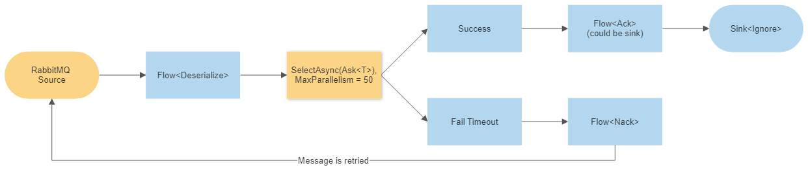

# Akka.Streams.Amqp.RabbitMQ with Akka.Cluster.Sharding - Reliable Delivery + Backpressure Support

The goal of this sample is to demonstrate how to use [Akka.Streams](https://getakka.net/articles/streams/introduction.html), and more specifically the [Alpakka connectors for RabbitMQ](https://github.com/akkadotnet/Alpakka), to build a reliable delivery mechanism that sends messages off to a set of actors distributed in an Akka.NET cluster via [Akka.Cluster.Sharding](https://getakka.net/articles/clustering/cluster-sharding.html).

## Technology

This solution is built with:

- .NET 6 minimal APIs;
- C# `record` types;
- Akka.NET v1.5 w/ Akka.Cluster;
- [Akka.Streams.Amqp.RabbitMq](https://www.nuget.org/packages/Akka.Streams.Amqp.RabbitMq); and
- [Akka.Hosting](https://github.com/akkadotnet/Akka.Hosting) - which minimizes the amount of configuration for Akka.NET to practically zero.

## Domain

We have two applications that can be run concurrently or independently in this sample:

1. `ReliableRabbitMQ.Producer` - a stand-alone console process which pumps messages into a RabbitMQ instance and
2. `ReliableRabbitMQ.Consumer` - a clustered Akka.NET process that uses a `ClusterSingletonManager` to run a single consumer from the [RabbitMQ](https://www.rabbitmq.com/) queue that `ReliableRabbitMQ.Producer` writes to and subsequently delivers its messages over the network via an Akka.Cluster.Sharding `ShardRegion` to a variety of `ProductActor`s, each of which has a chance of successfully processing the message or simulating a network failure and allowing it to timeout.

The domain is very simple as this sample is designed to teach infrastructure patterns primarily.

## Key Technical Details

### Backpressure

However, the most important and nuanced detail of this sample is the notion of _backpressure_ the ability to slow down the rate at which messages are pulled from RabbitMQ in the event that the cluster becomes unavailable or too backlogged to process messages promptly.

> "Backpressure," in layman's terms, is what happens in a asynchronous producer-consumer relationship when the producer produces at a faster rate than the consumer conumes. The "backpressure" eventually overwhelms the consumer and causes it to consistently fail as it simply can't keep up with the amount of work that is being sent to it. This is a fairly common problem in many asynchronous systems.

Backpressure can be mitigated via a variety of strategies (and this is Akka.Streams's speciality) - batching, buffering, aggregating, and dropping messages are all examples. However, the _best_ approach when you need to guarantee processing for every message is to simply pause message production from the consumer to the producer - and this works very well in concert with a durable queue such as RabbitMQ. 

The messages simply stay put inside RabbitMQ until the downstream Akka.NET consumers signal that they are ready for production once again. This allows the slower consumers to dictate the rate at which work is executed, resolving backpressure issues when the system is too busy to process everything that is produced all at once.

### Failure Handling

Backpressure is one concern, but it goes hand-in-hand with reliability. How do we guarantee that every message is processed at least once inside this system?



Our Akka.Streams graph on the consumer side is the key to making sure that all messages get processed successfully:

```csharp
// from RabbitMqConsumerActor.PreStart
var source = AmqpSource.CommittableSource(NamedQueueSourceSettings.Create(_connectionDetails, queueName)
    .WithDeclarations(queueDeclarations), _maxParallelism*2)
.SelectAsyncUnordered(_maxParallelism, async c =>
{
    var msg = serializer.FromBinary<CreateOrder>(c.Message.Bytes.ToArray());
    try
    {
        var result = await _productsShardRegion.Ask<OrderCommandAck>(msg, TimeSpan.FromSeconds(3));
        await c.Ack();
        return (IProcessResult)(new SuccessProcess(msg.OrderId));
    }
    catch (Exception e)
    {
        _log.Info(e, "Operation [{0}] failed - retrying.", msg.OrderId);
        await c.Nack();
        return new FailedProcess(msg.OrderId);
    }
})
.RunWith(Sink.ActorRef<IProcessResult>(Self, Complete.Instance), materializer);
```

The `SelectAsyncUnordered` stage allows the `Task<T>`s to propagate their results in the order in which they complete, as opposed to the order in which they were invoked (use `SelectAsync` instead if strict ordering is important to your application.) The `_maxParallelism` value, which is passed into our application via `appsettings.json`, determines the maximum number of inflight messages that are allowed to be out for processing at any given time. Once that limit is reached and the buffer for the `AmqpSource.CommittableSource` is full then no more messages will be read from RabbitMQ until some of those outstanding `Task<T>`s either timeout or complete successfully.

In the event of a successful `Ask<T>` operation to the `ShardRegion` `IActorRef`, the message is ACKed and removed from the queue.

In the event of a `Ask<T>` timeout or failure the message is NACKed and immediately re-queued for a retry attempt. The source will see that message again in the not too distant future. This feedback loop between Akka.Streams and RabbitMQ is what keep backpressure AND reliable delivery balanced throughout the operation of the application.

### Single Consumer or Multiple Consumers?

In this sample we use a `ClusterSingletonManager` to guarantee that there is only a single consumer from this queue:

```csharp
// from ReliableRabbitMQ.Consumer.Program.cs
.WithActors((system, registry) =>
{
    var rabbitMQConfiguration = context.Configuration.GetRequiredSection("RabbitMQ").Get<RabbitMQSettings>();
    var dr = DependencyResolver.For(system);
    var shardRegionActor = registry.Get<ProductActor>();
    var consumerProps = dr.Props<RabbitMqConsumerActor>(shardRegionActor, rabbitMQConfiguration.MaxParallelism);
    var singletonProps = system.ProductSingletonProps(consumerProps);
    registry.TryRegister<RabbitMqConsumerActor>(system.ActorOf(singletonProps,
        AmqpConsumerSingletonSettings.SingletonActorName));
});
```

This guarantees that regardless of the number of `ReliableRabbitMQ.Consumer` instances in the cluster, there can be at most one reader from the queue. This is quite helpful in cases where you need to ensure a limited degree of parallelism for processing, which is what we are doing here. This design can also be helpful in stances where data safety is a concern, as having a single consumer gives you the ability to control the order in which messages are routed to the cluster - whereas having multiple RabbitMQ clients all connected to the queue will result in a round-robin distribution to each with no precise guarantee as to ordering.

In cases where you need higher throughput, you can have a single consumer per `ReliableRabbitMQ.Consumer` node.

## Running Sample

### Launch Dependencies

To run this sample, we first need to spin up our dependencies - a RabbitMQ instance inside a Docker container that is largely running on all of the [default RabbitMQ ports](https://www.rabbitmq.com/networking.html).

**Windows**

```shell
start-dependencies.cmd
```

**Linux or OS X**

```shell
./start-dependencies.sh
```

### Run the Sample

Load up Rider or Visual Studio and

1. Launch `ReliableRabbitMQ.Consumer`, followed by
2. Launch `ReliableRabbitMQ.Producer`.

You should see console messages from the `ReliableRabbitMQ.Producer` indicating how many messages per second are being written to the RabbitMQ queue.

From the `ReliableRabbitMQ.Consumer` you should see a combination of success / failure messages, with retries being logged via the following:

```
[INFO][4/21/2022 5:36:34 PM][Thread 0078][akka.tcp://RabbitConsumer@localhost:57717/system/sharding/products/34/88] Previously failed order CreateOrder { OrderId = 46a3b798-5c21-465c-90a3-ae502ad6afd5, CustomerId = 4070, ProductId
 = 88, Quantity = 8 } for product [88] can now be successfully processed
[INFO][4/21/2022 5:36:34 PM][Thread 0078][akka.tcp://RabbitConsumer@localhost:57717/system/sharding/products/34/88] Added order CreateOrder { OrderId = 46a3b798-5c21-465c-90a3-ae502ad6afd5, CustomerId = 4070, ProductId = 88, Quant
ity = 8 } for product [88] - 11 total quantity ordered

```

That's an example of a message that had previously failed to be processed being successfully procesed.

If you turn off the `ReliableRabbitMQ.Producer` and let the consumer run it will eventually successfully process all previously queued messages and the queue will be empty.
